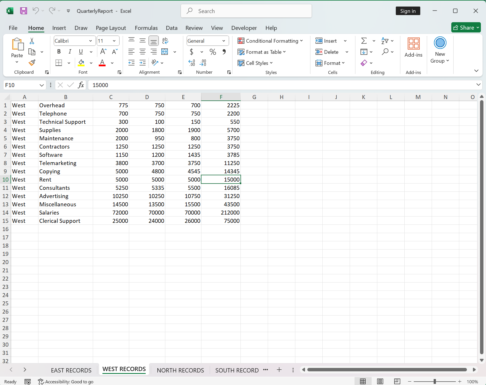
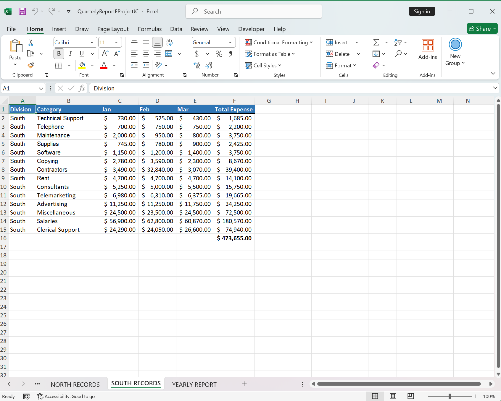
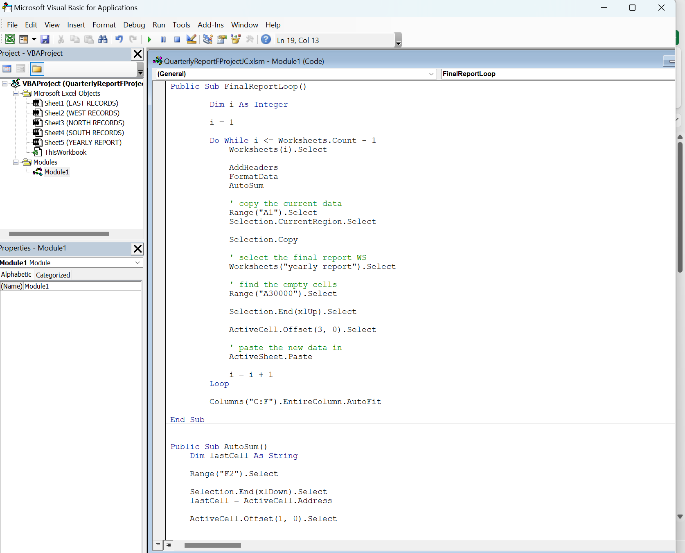
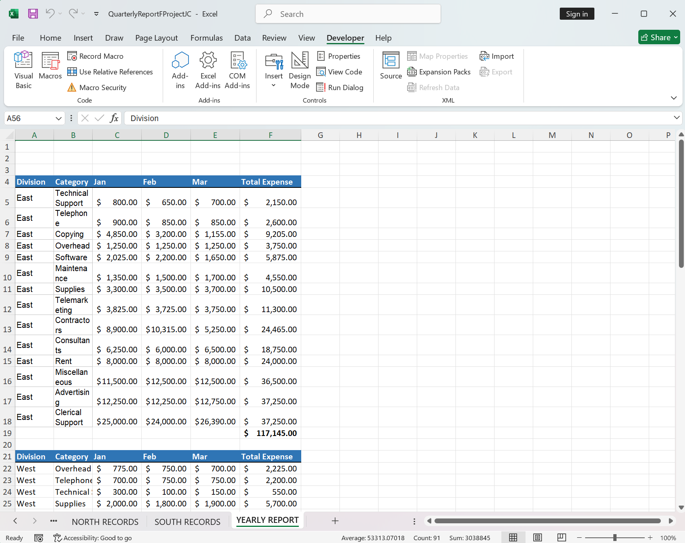

# Excel_VBA_Yearly_Expense_Report_Automation
Automated Excel reporting tool built with VBA that formats multiple worksheets, calculates totals, consolidates data into a yearly report, and provides a user-friendly interface through a custom UserForm.

# 1) Overview

This project automates the creation of a yearly expense report using Excel VBA.

The workbook processes multiple worksheets containing monthly expenses, applies consistent formatting, calculates total expenses, and combines all information into a master worksheet named "Yearly Report".

It introduces a graphical interface (UserForm) that allows users to:

- Select and navigate between worksheets.
- Add new worksheets dynamically.
- Generate the final report with a single button click.

This project was developed while completing the Udemy course:

Project Based Course on Excel VBA (Visual Basic for Applications) and Excel Macros

# 2) Features

# a) Report Automation

- Loops through all worksheets automatically.
- Skips empty worksheets.
- Inserts report headers.
- Applies formatting to tables and currency values.
- Calculates total expenses for each worksheet.
- Copies and consolidates all data into the Yearly Report sheet.
- AutoFits columns for improved readability.y

# b) User Interface

- Custom VBA UserForm displayed when the workbook opens.
- Worksheet selection through a ComboBox.
- One-click report generation.
- Ability to create new worksheets from the interface.

# 3) VBA Procedures

# a) FinalReportLoop

Main procedure that:

- Processes each worksheet.
- Adds headers.
- Formats data.
- Calculates totals.
- Copies each table into the Yearly Report worksheet.

# b) AddHeaders

Creates the report columns:

Column:
- Division
- Category
- Jan
- Feb
- Mar
- Total Expense

# c) FormatData:

Formats:
- Header row
- Borders
- Colors
- Currency style

# d) AutoSum

Calculates the total expense for each worksheet by inserting a SUM formula below the data.

# 4) UserForm Components

# a) cboWhichSheet

Allows users to select and navigate to any worksheet.

VB:

Private Sub cboWhichSheet_Change()
    Worksheets(Me.cboWhichSheet.Value).Select
End Sub

# b) cmdAddSheet

Creates a new worksheet and prompts the user to enter its name.

VB:

Private Sub cmdAddSheet_Click()
    Worksheets.Add Before:=Worksheets(1)

    ActiveSheet.Name = InputBox("Please enter a name for the new worksheet")
End Sub

# c) CmdRunReport

Runs the report generation process.

VB:

Private Sub CmdRunReport_Click()
    FinalReportLoop
End Sub

# d) Workbook_Open Event

Displays the UserForm automatically when the workbook is opened.

VB:

Private Sub Workbook_Open()
    frmFinalReport.Show
End Sub

# 5) Example Workflow

1. Open workbook.
2. The UserForm appears automatically.
3. Select an existing worksheet or create a new one.
4. Click Run Report.
5. Headers and formatting are applied.
6. Expense totals are calculated.
7. Data from all worksheets is consolidated into the Yearly Report sheet.
8. Final columns are adjusted automatically.

# 6) Technologies Used

- Microsoft Excel
- VBA (Visual Basic for Applications)
- Excel Macros
- UserForms
- Excel Object Model

# 7) Skills Demonstrated

# a) VBA Programming

- Procedures and subroutines
- Variables
- Loops (For, Do While)
- Event-driven programming

# b) Excel Automation

- Worksheet manipulation
- Dynamic range selection
- Copy and paste automation
- Relative cell navigation
- Formula generation
- Formatting and styling

# c) User Interface Design

- UserForms
- ComboBoxes
- Command Buttons
- Workbook events

# d) Excel Object Model

- Worksheets collection
- ActiveSheet and ActiveCell objects
- Range and Selection methods

# 8) Future Improvements

- Eliminate reliance on .Select and ActiveCell.
- Use worksheet object variables for better performance.
- Add error handling for duplicate worksheet names.
- Allow dynamic month ranges (12 months instead of Jan–Mar).
- Export reports to PDF automatically.
- Add charts and dashboard visualizations.
- Convert the solution into a reusable reporting template.

# 9) Screenshots

Source worksheets

UserForm Interface

Formatted data

VBA Script

Final yearly report

